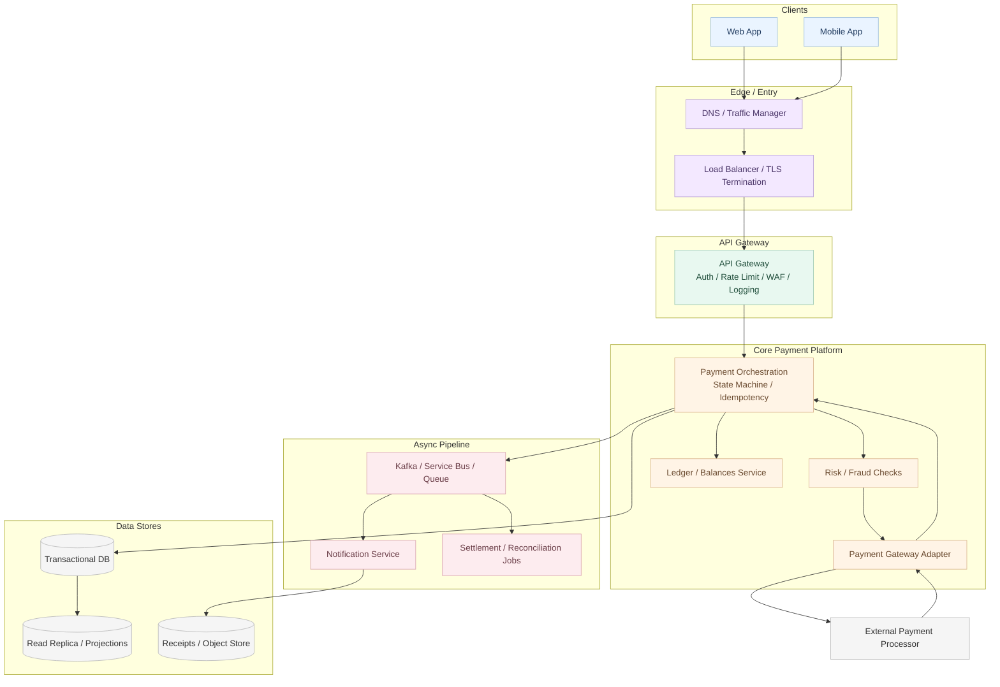

# Component model and data flow (payment systems)

Generic answers (“UI → DNS → API gateway → middle tier → message bus → database”) under-score in principal-level rounds. Anchor the design in **money movement** and **state**.

## Verbal “diagram” you can deliver without a whiteboard

Work through **named boxes and arrows**:

1. **Clients** — Web and mobile apps.
2. **Edge** — DNS, global or regional traffic management, TLS termination (often at gateway or load balancer).
3. **API gateway** — Authentication, coarse authorization, **rate limiting**, routing, request logging, sometimes WAF integration. Single public entry; internal services are not directly reachable from the internet.
4. **Payment orchestration** — Owns the payment **workflow**: validate request, create intent, coordinate risk checks, call the processor adapter, transition state, emit events.
5. **Ledger / balances service** — Authoritative posting of financial movements (often separate from “CRUD on a payments row”).
6. **Payment gateway adapter** — Isolates vendor-specific APIs; timeouts, retries, and idempotency live here or in orchestration with clear ownership.
7. **Risk / fraud** — Sync or async scoring before capture; may be stubbed in small designs but should be named.
8. **Async pipeline** — Queue or log (Kafka, Service Bus, SQS) for notifications, webhooks, settlement batches, reconciliation jobs.
9. **Notification service** — Email, SMS, push from outbox or consumer.
10. **Data stores** — Transactional primary for writes; replicas or OLAP/search for history; optional object store for receipts.

**Flow (happy path, simplified):** Client → gateway → orchestration → (risk) → adapter → processor → orchestration updates state → ledger posts → event → notification.

## Read/write split (how to phrase it)

- **Write path** — Strongly consistent records for payment state and ledger entries.
- **Read path** — History and lists may be served from replicas or projections with **known staleness**; never show a “success” balance before the write path commits.

Mention **replication lag** and what UX you expose: pending vs completed, refresh strategy.

## API gateway: go beyond “first line of defense”

In interviews, add: routing to services, **TLS**, optional **mTLS** internal, correlation IDs, basic **WAF**, sometimes **API versioning** and canary routing. IP allowlisting alone is not a complete story.

## Middle tier: payment-specific responsibilities

The orchestration layer should own:

- **State machine** for payments (initiated → authorized → captured → failed → refunded, etc.).
- **Idempotency** on submit paths.
- **Correlation** between internal IDs and processor references.
- **Observability** — Structured logs, traces across adapter calls.

This turns “middle tier” into a design the interviewer can score.
