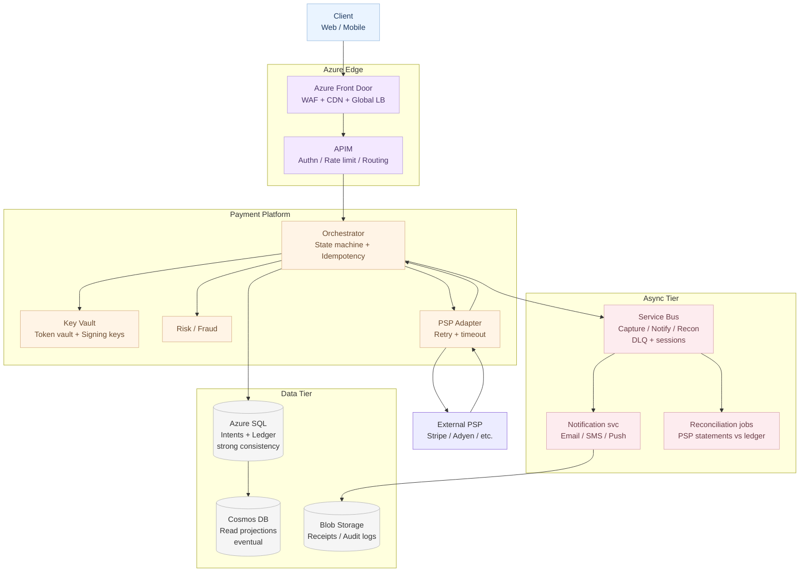

# Diagram: payment E2E (Azure)

Azure-specific rendering of the payment flow. Extend in the room — add Private Endpoints on adapter, Managed Identity on Key Vault access, or zone-redundant SQL replicas as depth demands.

Generic component-level diagram (non-Azure): [`../../01_foundations/02_component-model-and-data-flow.md`](../../01_foundations/02_component-model-and-data-flow.md).

## Azure service decisions at each tier

| Tier | Service | Why over generic |
|------|---------|-----------------|
| Edge | **Front Door** | Global anycast, WAF, CDN for static assets — single entry replaces regional load balancer + CDN stacks |
| API | **APIM** | Managed OAuth2/JWT validation, rate limiting per subscription, API versioning, developer portal |
| Vault | **Key Vault** | Hardware-backed HSM tier for PAN token encryption keys; Managed Identity access — no secrets in config |
| Money path | **Azure SQL** | ACID guarantees for ledger posts; zone-redundant replicas; row-level security for PCI isolation |
| Read path | **Cosmos DB** | Multi-region reads for history/receipts; tunable consistency (session for post-payment UX, eventual for analytics) |
| Async | **Service Bus** | Sessions = per-account ordering for ledger events; DLQ for stuck captures; exactly-once with peek-lock |
| Receipts | **Blob Storage** | Immutable storage tier for audit; lifecycle rules for retention; CDN-served receipts |

## Failure angles specific to this diagram

See [`03_failures.md`](03_failures.md) for scenario-by-scenario Azure breakdown (Key Vault degradation, Service Bus DLQ, regional failover dual-capture risk).
