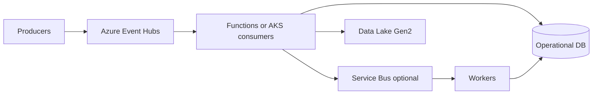

# Diagrams: event-driven architecture on Azure

## Narration (interview order)

1. **Produce:** Services publish to **Event Hubs** (partitioned stream, replay).
2. **Process:** **Functions** or **AKS** consumers read partitions; checkpoint offsets.
3. **Hand off:** Optional **Service Bus** for per-task work, **DLQ**, sessions.
4. **Persist:** **Operational DB** for state; **Data Lake** for analytics / replay-derived loads.



**ASCII**

```text
Producer -> Event Hubs -> Consumer -> (Service Bus) -> Worker -> DB
                        \-> Data Lake (analytics path)
```
