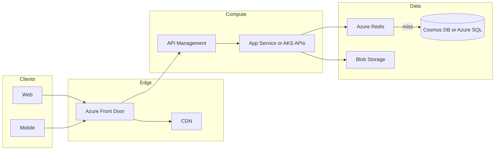
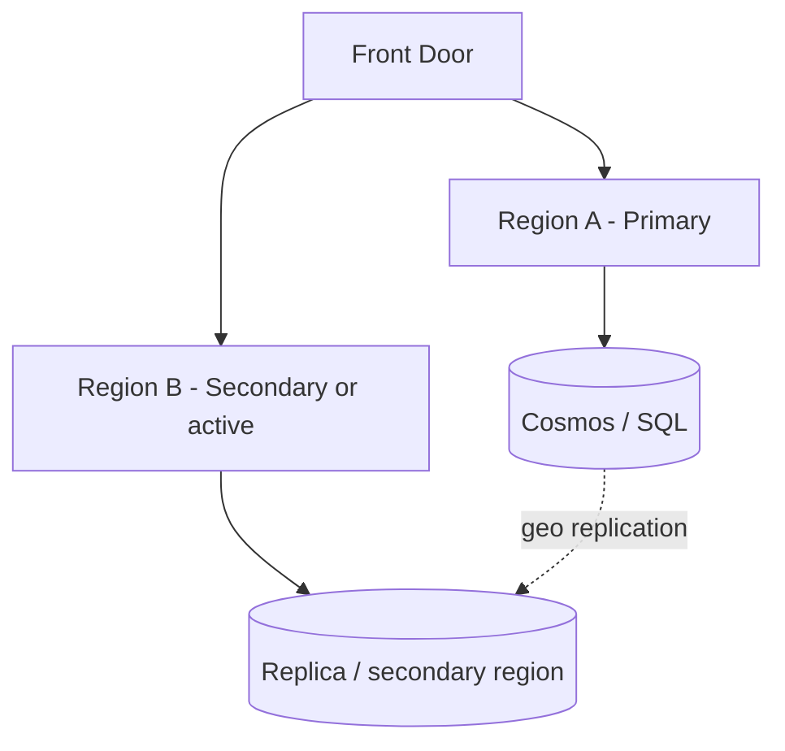

# Diagrams: global HA web app on Azure

## Narration (use this order in the interview)

1. **Entry:** User hits **Azure Front Door** (TLS, WAF, routing to nearest healthy origin).
2. **Gateway:** Traffic hits **API Management** for auth, quotas, and optional caching.
3. **Compute:** **App Service** (or AKS) runs stateless APIs.
4. **Fast path:** **Redis** for hot reads; on miss, **Cosmos DB** or **Azure SQL**.
5. **Media:** Large objects to **Blob Storage** (not through DB).

## Request flow (read path)



## Multi-region (evolution)



**ASCII**

```text
Client -> Front Door -> APIM -> API -> Redis -> DB
                              \-> Blob
```
