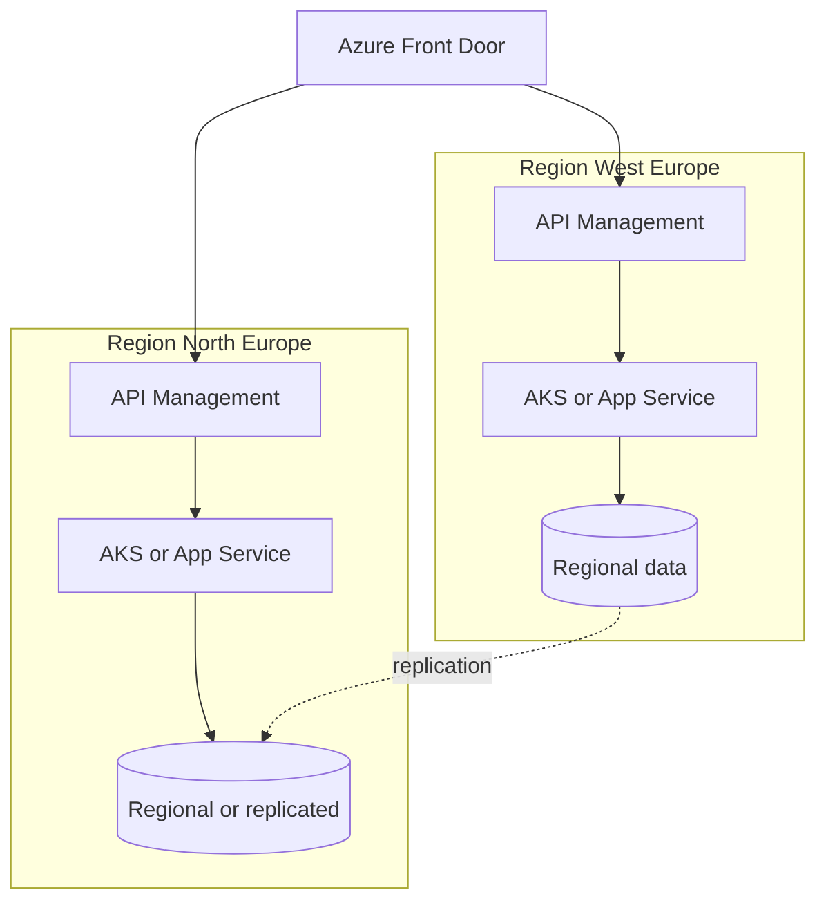

# Diagrams: multi-region API on Azure

## Narration (interview order)

1. **Global entry:** **Front Door** picks region by health/latency policy.
2. **Per region:** **API Management** enforces OAuth, quotas, policies.
3. **Compute:** **App Service** / **AKS** / **Container Apps** serves APIs locally.
4. **Data:** Regional or replicated store (**Cosmos** multi-region or **SQL** failover)—state consistency model aloud.

