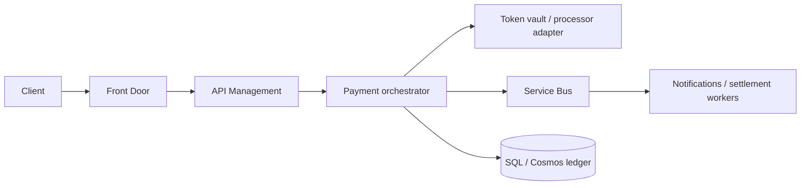

# Diagram: payments on Azure

## Narration walkthrough

1. **Entry:** User or client hits **Front Door** (TLS, WAF, optional geo routing).
2. **Gateway:** **APIM** authenticates, applies quotas, may validate **idempotency-Key** or forward to orchestrator policy.
3. **Compute:** **Payment orchestrator** runs the **state machine** (authorize, capture, refund), calls **adapter** to processor, writes **intent + ledger** rows.
4. **Data:** **SQL or Cosmos** holds durable **ledger** and **outbox** (if used); no PAN in application telemetry.
5. **Async:** **Service Bus** carries capture/settlement jobs, notifications, and other **side effects**; workers consume with **DLQ** and idempotent handlers.
