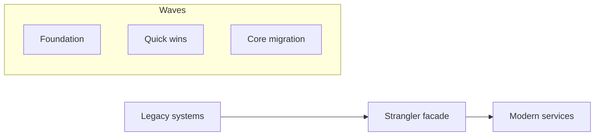

# Diagram: portfolio modernization


```mermaid
flowchart LR
  L[Legacy systems]
  S[Strangler facade]
  M[Modern services]
  L --> S --> M
  subgraph waves [Waves]
    W1[Foundation]
    W2[Quick wins]
    W3[Core migration]
  end
```

**ASCII**

```text
Legacy -> Strangler API -> New domain services -> Shared platform (ID, CI/CD, observe)
```
