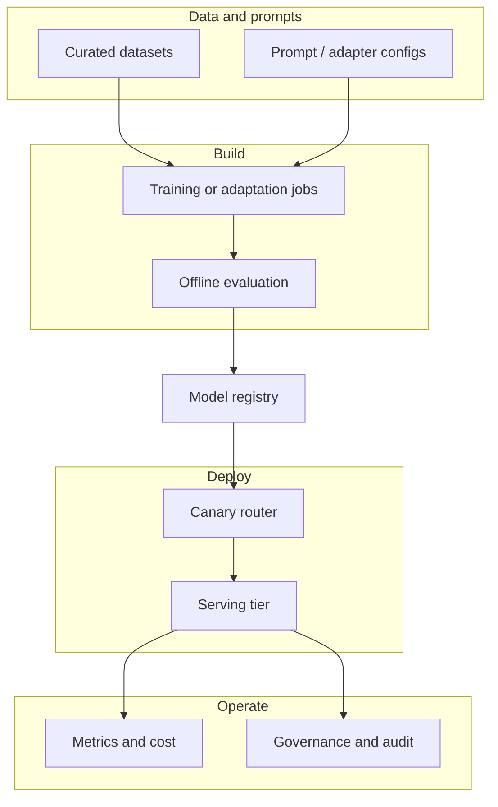

# Diagram: LLMOps lifecycle and governance

## Narration walkthrough

1. **Inputs:** Approved **datasets** and **configs** feed training or **adapter** jobs (not ad-hoc laptops for prod).
2. **Build:** Jobs write **versioned** artifacts; **offline eval** must pass before registry promotion.
3. **Registry:** Single source of truth for **which artifact** is **candidate** vs **production** and **who signed off**.
4. **Deploy:** **Canary** sends a slice of traffic to the new version; **rollback** is a routing change.
5. **Operate:** **Metrics** (latency, errors, cost, quality proxies) and **governance** (policy, audit) close the loop.
