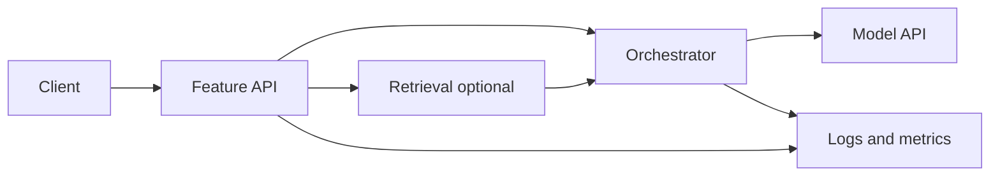

# Diagram: LLM-backed feature (IC scope)

## Narration walkthrough

1. **Client** hits **your** feature API with a scoped token or session.
2. **API** validates input, applies **per-user** limits, may call **retrieval** with tenant filters.
3. **Orchestrator** assembles the prompt, calls **model API** with a **timeout**, parses output.
4. **Logs** capture latency, outcome, and model version—**not** secrets or full PII unless policy requires and secured.
