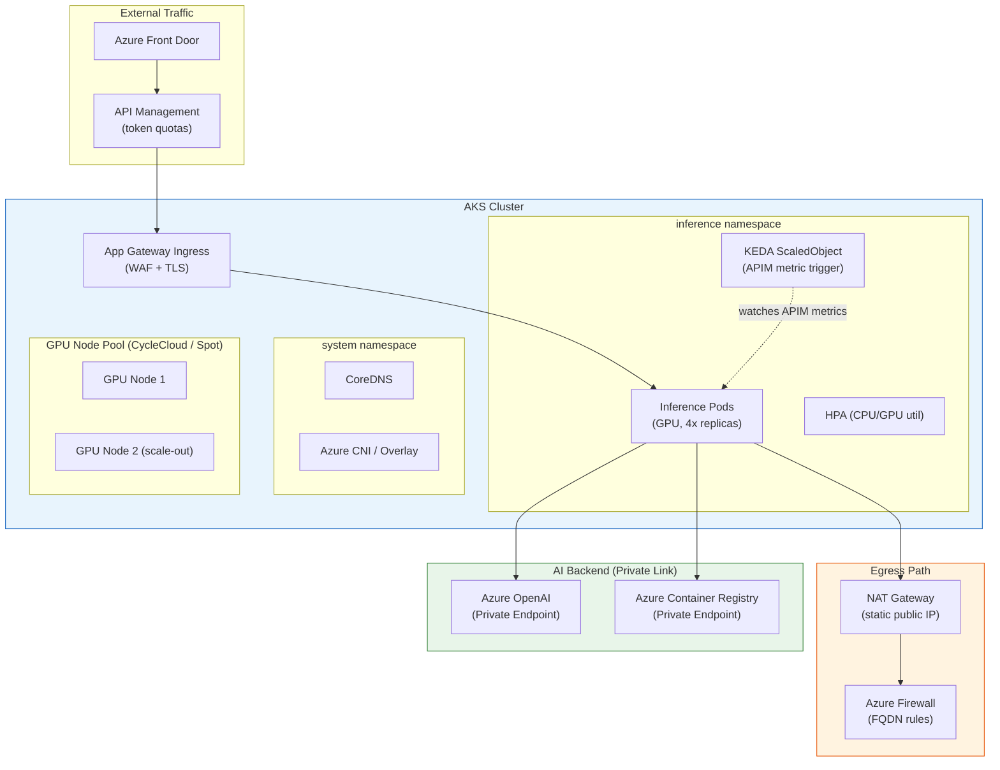
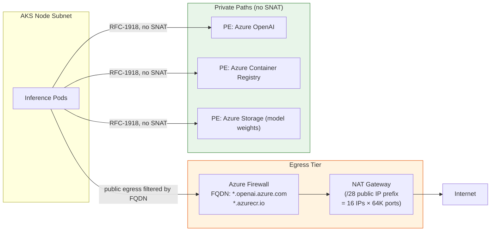

# AKS inference under spikes — autoscaling, KEDA, SNAT, egress

**Bar:** Staff+ / Principal
**Time:** 30 minutes whiteboard + 10 minutes follow-up
**Companion files:** `failures.md`, `followups.md`, `tradeoffs.md`

---

## Scenario

Your enterprise AI platform runs custom model inference on **AKS** (GPU node pools). A product launch drives a 10× traffic spike over 90 seconds. You observe:

- Inference pods time out on first request after scale-out (new pods appear but return errors)
- KEDA metric lag means autoscaler reacts 45 seconds late
- Random API calls to Azure OpenAI return `dial tcp: i/o timeout` from inside the cluster

Diagnose and redesign the autoscaling and egress architecture.

---

## Architecture diagram



---

## Structured answer

### 1. Clarify first

- What model? (GPU-bound custom model vs AOAI API call)
- What traffic pattern? (real-time chat vs batch inference)
- What's the node scale-out time? (standard D-series vs GPU P100/A100 — GPU nodes take 5–8 min to provision)
- Private endpoints or public AOAI?

---

### 2. Diagnose the three failures

#### 2.1 Pods appear but return errors on first request

**Root cause:** New GPU pods take 2–4 minutes to pull image + load model weights before serving. AGIC health probe hits an unready pod.

**Fix:**
- Add proper `readinessProbe` with `initialDelaySeconds: 120` or a custom `/healthz` that returns 200 only after model is loaded.
- Use **preStop hook** to drain in-flight requests before termination (graceful shutdown).
- Consider **model caching on node local SSD** to reduce cold start: pull model from Blob at first boot, cache on `/dev/shm` or ephemeral NVMe.

#### 2.2 KEDA autoscaler reacts 45 seconds late

**Root cause:** KEDA polling interval default is 30s. APIM metric aggregation adds another 30s lag. Combined = 60s before first scale signal.

**Fix:**
- Reduce KEDA `pollingInterval` to `10` seconds for the inference ScaledObject.
- Use a **custom APIM metric trigger** (HTTP request queue depth, not throughput) so scale signal fires before tokens are exhausted.
- Add **predictive scaling**: if historical data shows spikes at 09:00 on Mondays, schedule a KEDA `ScaledJob` cron trigger to pre-warm nodes before traffic arrives.
- Keep **minimum replicas = 1** (not zero) for latency-sensitive inference — eliminates cold start for first request.

```yaml
# KEDA ScaledObject example
apiVersion: keda.sh/v1alpha1
kind: ScaledObject
metadata:
  name: inference-scaler
spec:
  scaleTargetRef:
    name: inference-deployment
  pollingInterval: 10        # reduced from 30
  cooldownPeriod: 120
  minReplicaCount: 1         # never zero for latency-sensitive
  maxReplicaCount: 20
  triggers:
    - type: azure-monitor
      metadata:
        resourceURI: /subscriptions/.../apim/...
        metricName: RequestsInQueue
        targetValue: "10"
```

#### 2.3 `dial tcp: i/o timeout` — SNAT port exhaustion

**Root cause:** AKS pods making many outbound TCP connections (e.g., to AOAI or ACR) exhaust the SNAT port table on the load balancer. Default SNAT allocations per node = 1024 ports. 10 pods × 100 concurrent connections > 1024.

**Diagnosis steps:**
1. `kubectl exec <pod> -- ss -s` — check `TIME_WAIT` connection count.
2. Azure Monitor: `SnatConnectionCount` metric on the Load Balancer — look for exhaustion (value near max).
3. `kubectl logs <pod>` — `i/o timeout` on outbound calls to `*.openai.azure.com`.

**Fix options (ordered):**
1. **NAT Gateway** (recommended): Attach a NAT Gateway with multiple public IP prefixes to the AKS subnet. Each public IP = 64,512 SNAT ports. Eliminates SNAT exhaustion for most workloads.
2. **Connection pooling in application code**: Reuse HTTP clients (singleton `HttpClient` in .NET, `requests.Session` in Python). Each pooled connection holds a SNAT port open but prevents new ports being allocated per request.
3. **Private Endpoints for AOAI and ACR**: Private traffic never leaves the VNet — no SNAT involved. This is the cleanest long-term fix and the security-correct path.

---

### 3. Egress architecture



**Key design decisions:**
- Use a `/28` public IP prefix for NAT Gateway — stable SNAT source IP range, easy to allowlist at destination firewalls.
- Azure Firewall for FQDN egress filtering (blocks unexpected callouts from compromised pods).
- Private Endpoints for all Azure PaaS — no SNAT, faster, cheaper, secure.

---

### 4. GPU node pool design

| Concern | Recommendation |
|---------|----------------|
| Scale-out speed | Use **Cluster Autoscaler** pre-provisioned buffer: `overprovisioning` DaemonSet or buffer pods that hold GPU capacity unscheduled |
| Cost | Mix **on-demand** (minimum capacity) + **Spot** (burst, with eviction-tolerant workloads) |
| Image pull time | **ACR Private Endpoint** + **ACR Geo-replication** in same region. Cache heavy layers on node using `containerd` image pre-pull DaemonSet |
| GPU scheduling | Use `resources.limits.nvidia.com/gpu: 1` to prevent noisy neighbor; `fractional GPU` for smaller models via NVIDIA MIG |

---

### 5. End-state architecture summary

| Layer | Solution | Why |
|-------|----------|-----|
| Scale trigger | KEDA with 10s polling, APIM queue depth metric | Fastest scale signal, not CPU-lagged |
| Scale speed | Pre-warmed on-demand nodes + Spot for burst | Avoid 5-min GPU node cold start |
| SNAT | NAT Gateway `/28` prefix + Private Endpoints for AOAI/ACR | Eliminates port exhaustion, secure |
| Cold start | `readinessProbe` + model cache on local SSD | Pods only receive traffic when ready |
| Graceful shutdown | `preStop` hook + `terminationGracePeriodSeconds: 60` | No in-flight request dropped on scale-in |

---

### 6. What breaks first under load (ordered)

1. SNAT ports exhausted → dial timeout to public endpoints
2. GPU pods scale out but serve errors → missing readiness probe
3. KEDA fires late → 45+ second gap in autoscale response
4. ACR image pull contends with pod scheduling → node bootstrap slow
5. Firewall SNAT pool exhausted if all egress goes through Azure Firewall (add NAT Gateway to offload)

---

*Related: `../01_templates/troubleshooting-drills-platform-ai.md` (drill 2: Private Link "sometimes works" — SNAT diagnosis)*
