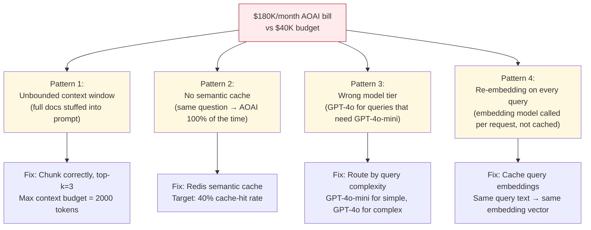
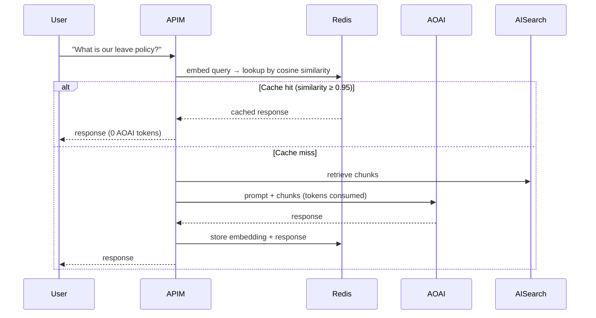
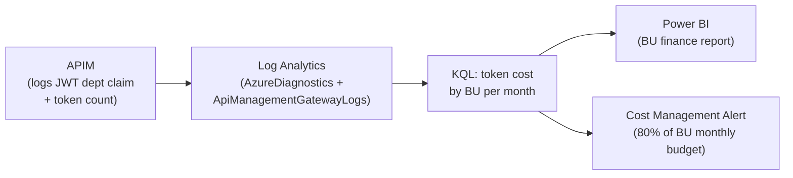

# OpenAI cost explosion post-go-live: diagnosis and remediation

**Bar:** Staff+
**Time:** 25 minutes whiteboard + 10 minutes follow-up
**Scenario type:** Incident + FinOps redesign

---

## Scenario

Three weeks after enterprise RAG goes live, the monthly Azure bill shows AOAI costs running at **$180K/month** vs the budgeted **$40K/month**. The CFO emails the CTO. You have 24 hours to explain what happened and a week to fix it. Walk through your diagnosis and remediation plan.

---

## Diagnosis: the four cost explosion patterns



---

## Step 1 — Establish the baseline (first 2 hours)

### 1.1 Token usage breakdown via Log Analytics

```kql
// Total tokens by model
AzureDiagnostics
| where ResourceProvider == "MICROSOFT.COGNITIVESERVICES"
| where OperationName == "ChatCompletions_Create"
| summarize
    TotalPromptTokens = sum(toint(properties_s.usage.prompt_tokens)),
    TotalCompletionTokens = sum(toint(properties_s.usage.completion_tokens)),
    RequestCount = count()
  by ModelDeploymentName = tostring(properties_s.model)
| order by TotalPromptTokens desc
```

**What to look for:**
- Is one model (GPT-4o) consuming >90% of tokens? (should be mixed with GPT-4o-mini)
- Are `prompt_tokens` disproportionately high vs `completion_tokens`? → unbounded context stuffing
- Is `RequestCount` far higher than expected unique user sessions? → missing cache

---

### 1.2 Per-BU attribution

```kql
// Token cost by BU (requires JWT tid claim logged in APIM)
ApiManagementGatewayLogs
| where OperationId contains "openai"
| extend BU = tostring(parse_json(AuthorizationInfo).claims.department)
| summarize
    Requests = count(),
    AvgDurationMs = avg(DurationMs)
  by BU
| order by Requests desc
```

**What to look for:** Is one BU's batch job generating 70% of volume? (Pattern 4: unbounded re-embed batch runs)

---

## Step 2 — Root cause triage checklist

| Check | How to verify | Expected vs Actual |
|-------|--------------|-------------------|
| Average `prompt_tokens` per request | Log Analytics KQL on AOAI diagnostic logs | Target: <2000 tokens. Red flag: >8000 tokens |
| Cache hit rate | Redis `keyspace_hits` vs `keyspace_misses` | Target: >40%. Red flag: <5% (cache barely used) |
| Model tier mix | Token count by model deployment name | Target: 70% GPT-4o-mini, 30% GPT-4o. Red flag: 100% GPT-4o |
| Embedding call rate vs query rate | Count `Embeddings_Create` calls vs chat calls | Target: 1:1 only on cache miss. Red flag: 1:1 on every request (no embedding cache) |
| Re-indexing jobs running in prod hours | ADF pipeline run history | Target: off-peak. Red flag: daily full re-index during business hours |

---

## Step 3 — Remediation plan (priority order)

### Fix 1: Implement semantic cache (highest ROI, fastest)

**Impact:** 30–60% token reduction for repeated or near-identical queries.



**Implementation:** Azure Cache for Redis (P1 tier) with embedding hash as cache key. TTL = 24h (tune per query type). Similarity threshold = 0.95.

---

### Fix 2: Enforce context window budget

**Problem:** ADF retrieves top-10 chunks, full documents concatenated → 12,000 prompt tokens per call.

**Fix:**
- Hard cap: `max_context_tokens = 2000` (configurable per query type in APIM policy).
- Reduce top-k from 10 to 3 for standard queries; 5 for document-heavy summarization.
- Truncate individual chunks at 400 tokens; strip boilerplate headers/footers during ingestion.

**Expected saving:** $40K/month (60K → 15K tokens per session).

---

### Fix 3: Route by query complexity (model tiering)

| Query type | Model | Tokens | Cost per 1M |
|------------|-------|--------|-------------|
| Simple FAQ, status check, reformatting | GPT-4o-mini | ~800 completion | $0.60 |
| Multi-doc synthesis, reasoning, compliance | GPT-4o | ~2000 completion | $15.00 |
| Embedding (query only) | `text-embedding-3-small` | ~100 | $0.02 |

**APIM routing policy sketch:**
```xml
<choose>
  <when condition="@(context.Request.Headers.GetValueOrDefault("X-Query-Complexity","simple") == "complex")">
    <set-backend-service base-url="https://<aoai>/openai/deployments/gpt-4o" />
  </when>
  <otherwise>
    <set-backend-service base-url="https://<aoai>/openai/deployments/gpt-4o-mini" />
  </otherwise>
</choose>
```

**Calling app classifies complexity** (or APIM uses token estimation heuristic on prompt length).

---

### Fix 4: Cache query embeddings

**Problem:** Every request calls `text-embedding-ada-002` or `text-embedding-3-large` to embed the user query, even if the query was seen before.

**Fix:**
- SHA-256 hash of normalized query text as Redis key for embedding vector.
- Cache embedding for 1 hour (query meaning doesn't change in 1 hour).
- Expected reduction: 90% fewer embedding API calls for FAQ-style traffic.

---

### Fix 5: Move re-indexing batch jobs to off-peak

**Problem:** ADF full re-index runs every day at 10:00 local time — peak business hours. Each re-index embeds 500K document chunks × $0.02/1K tokens = $500/day for the embedding job alone.

**Fix:**
- Move ADF pipeline to 02:00 UTC.
- Switch from full re-index to **delta crawl** — only re-embed documents modified since last run.
- Expected saving on embedding: 80% (delta typically 5–15% of corpus per day).

---

## Step 4 — FinOps governance (prevent recurrence)

### 4.1 Per-BU chargeback dashboard



### 4.2 Token governance policies (APIM)

```xml
<!-- Max tokens per request -->
<set-body>
  @{
    var body = context.Request.Body.As<JObject>();
    body["max_tokens"] = 1000;   // hard cap
    return body.ToString();
  }
</set-body>

<!-- Per-BU monthly token budget (rate-limit-by-key variant) -->
<rate-limit-by-key calls="500000" renewal-period="2592000"
  counter-key="@(context.Request.Headers["X-BU-Id"])" />
```

### 4.3 Spend alert thresholds

| Alert | Threshold | Action |
|-------|-----------|--------|
| Daily AOAI spend | >$3K/day | Page on-call FinOps engineer |
| Single BU monthly | >$15K | Notify BU manager + freeze batch jobs |
| Embedding call rate | >5× baseline | Investigate cache miss root cause |
| PTU utilization | <50% for 7 days | Consider PAYG switch |

---

## Projected cost after fixes

| Lever | Before | After | Saving |
|-------|--------|-------|--------|
| Semantic cache (40% hit rate) | $180K | $108K | $72K |
| Context window capping | $108K | $65K | $43K |
| Model tiering (70% mini) | $65K | $35K | $30K |
| Delta re-index (embedding) | $35K | $28K | $7K |
| **Total** | **$180K** | **~$28K** | **$152K** |

> Note: Present projections as estimates with ±20% uncertainty; actual depends on traffic mix.

---

## What to say in the executive summary

> "We had four cost amplifiers active simultaneously: oversized prompts, no query caching, uniform use of the most expensive model, and daily full re-indexing. We've implemented query caching and context caps this week, which together should reduce spend by 80%. Model tiering and delta indexing deploy next week. We'll have per-BU chargeback in the Power BI dashboard by end of month so every BU sees their consumption, and we'll set monthly budget alerts at the BU level going forward."

---

*Related: `../01_templates/troubleshooting-drills-platform-ai.md` (drill 7: cost spike after AI go-live), `../enterprise-rag-platform-principal/tradeoffs.md`*
