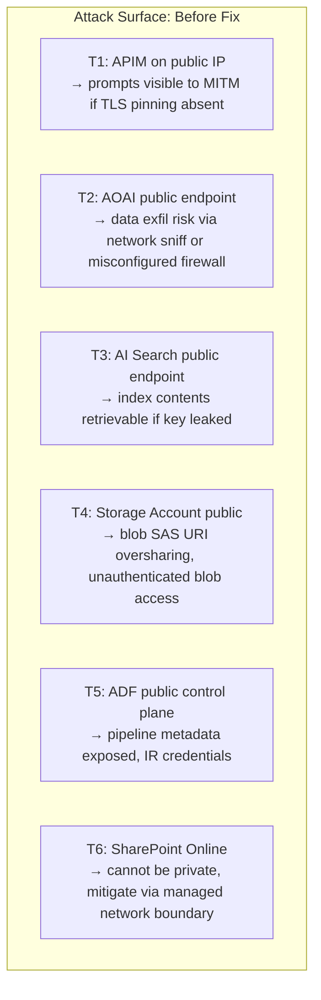
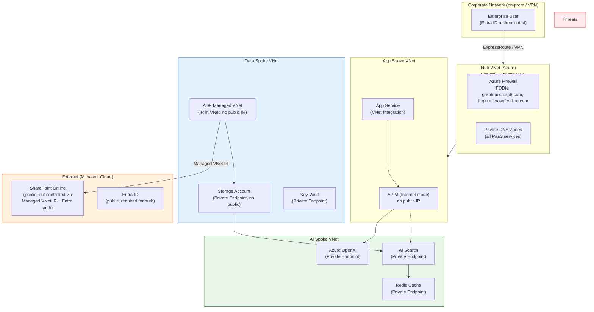
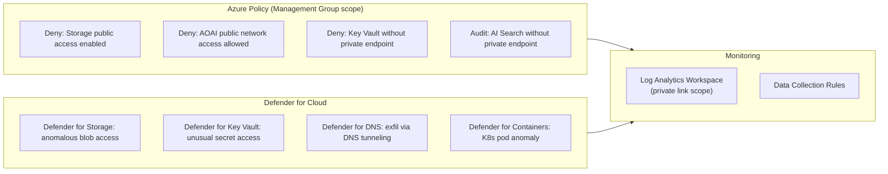

# Security review: RAG platform with zero public data paths

**Bar:** Principal
**Time:** 30 minutes whiteboard
**Scenario type:** Adversarial security review — the candidate is asked to break the design, then fix it.

---

## Scenario

You are reviewing a RAG platform designed by another team. The stated requirement: **no enterprise document data or LLM prompts may traverse a public network at any point**. Walk through every component, identify every public path that still exists, and redesign to close them.

> Starting design: App Service → APIM (public) → Azure OpenAI (public endpoint) → AI Search (public) → Storage Account (public) → ADF (managed VNet) → SharePoint Online

---

## Security threat model

---

## Redesigned architecture: zero public paths

---

## Component-by-component security analysis

### C1 — APIM: Close public endpoint

**Threat:** APIM deployed with a public virtual IP exposes prompt payloads to internet scanning. Even with TLS, the DNS name is publicly resolvable.

**Fix:**
- Deploy APIM in **Internal mode** (private VIP only, RFC-1918).
- Front with **Azure Front Door** (for global load balancing) with WAF policy, or
- Restrict to **ER/VPN-connected users only** if external access not needed.
- APIM internal mode requires a dedicated subnet; DNS resolves to private IP via private DNS zone.

**Validation:** `nslookup <apim>.azure-api.net` from outside the VNet returns NXDOMAIN or private IP only.

---

### C2 — Azure OpenAI: Disable public access

**Threat:** Public endpoint accessible from internet with API key — key leakage = full model access.

**Fix:**
- Set `publicNetworkAccess: Disabled` on the AOAI resource.
- Create a Private Endpoint in the AI spoke VNet.
- Private DNS zone `privatelink.openai.azure.com` linked to AI spoke and hub.
- Managed Identity for APIM → AOAI (no API keys).

**Validation:** `curl https://<aoai>.openai.azure.com/openai/models` from outside VNet returns `403 Forbidden` (not `200 OK`).

---

### C3 — Azure AI Search: Disable public access + enforce security trimming

**Threat:** Public endpoint + leaked admin key = full index dump. Even with private endpoint, missing security trimming leaks cross-tenant documents.

**Fix:**
- Set `publicNetworkAccess: Disabled`.
- Private Endpoint in AI spoke VNet.
- Search API key replaced with **Managed Identity RBAC** (`Search Index Data Reader`).
- OData filter on every query: `$filter=tenantId eq '{jwt_claim}'` enforced in APIM policy.

**Validation:** Query from APIM without OData filter → APIM policy must inject filter; direct query to Search PE without filter header → Search service responds but APIM blocks the bypass path.

---

### C4 — Storage Account: Disable public + enforce private endpoint

**Threat:** Public blob access, overpermissive SAS URIs, or public container with anonymous read.

**Fix:**
- `allowBlobPublicAccess: false` at storage account level.
- `publicNetworkAccess: Disabled`.
- Private Endpoint for `blob` and `file` sub-resources in data spoke.
- Managed Identity RBAC for ADF and AI Search indexer (`Storage Blob Data Reader`).

**Validation:** `az storage blob list --account-name <sa> --container-name <c> --auth-mode login` from outside VNet — must fail with `AuthorizationFailure`.

---

### C5 — ADF: Managed VNet Integration Runtime

**Threat:** Default ADF Integration Runtime uses shared Azure IR — data traverses Microsoft public backbone. Public IR can call public endpoints.

**Fix:**
- Enable **Managed Virtual Network** on ADF.
- Create a **Managed Private Endpoint** to Storage and SharePoint (via managed VNet).
- For SharePoint Online: ADF Managed VNet IR connects via private managed endpoint — data never leaves Microsoft's managed private network.
- Disable `publicNetworkAccess` on ADF itself where region supports it.

**Limitation to name:** SharePoint Online is a public Microsoft 365 service. Traffic from ADF Managed VNet IR to SPO traverses Microsoft's private backbone via Managed Private Endpoints for M365. This is the closest to "private" that SPO allows — acknowledge this explicitly.

---

### C6 — Key Vault: Private Endpoint + purge protection

**Threat:** Key Vault with public endpoint means secrets accessible from any IP if firewall misconfigured.

**Fix:**
- Private Endpoint in data spoke VNet.
- `publicNetworkAccess: Disabled`.
- Purge protection: enabled (prevents accidental secret deletion).
- Managed Identity RBAC: `Key Vault Secrets User` scoped to specific secrets, not vault-wide.

---

## Security enforcement: Policy and Defender

**Key policy assignments:**
- `Deny: Storage accounts should disable public network access`
- `Deny: Azure Cognitive Services accounts should disable public network access`
- `Audit: Azure AI Search services should use private link`
- `Deny: Key vaults should use private link`

---

## Residual risk acknowledgement (principal bar)

A complete answer names what cannot be made fully private:

| Component | Residual public path | Mitigation |
|-----------|---------------------|------------|
| Entra ID authentication | Auth flows must reach `login.microsoftonline.com` (public) | Firewall allow-list with FQDN tag; cannot be fully private |
| SharePoint Online | M365 public SaaS | ADF Managed VNet IR to managed private endpoint (Microsoft backbone) |
| Azure Monitor / Log Analytics | Telemetry to `*.monitor.azure.com` | Azure Monitor Private Link Scope (AMPLS) to private endpoint for LA workspace |
| APIM developer portal | If external BUs need API docs | WAF + Front Door with geo-restriction; disable if internal-only |

---

## What breaks first under attack

1. **Misconfigured OData filter** — cross-tenant document leakage; test with a known unauthorized user.
2. **Public network access not disabled** on AOAI — external API key brute-force; Defender alerts but doesn't block.
3. **ADF IR not on Managed VNet** — document content traverses public Microsoft backbone; no visible alert.
4. **Log Analytics workspace without AMPLS** — telemetry (including prompt traces) exits via public endpoint.
5. **APIM in external mode** — prompts and responses visible to network-level MITM in absence of cert pinning.

---

*Related: `../01_templates/troubleshooting-drills-platform-ai.md`, `../enterprise-rag-platform-principal/architecture.md`*
