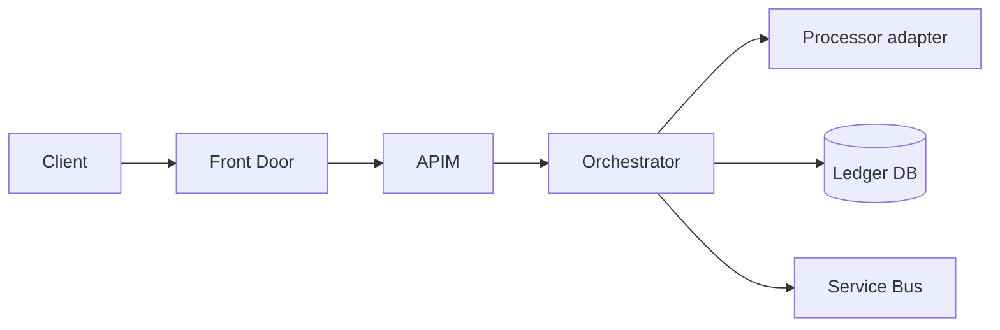

# Diagram: payment E2E

Reuse and extend: `../../../01_azure-solutions-architect-role-pattern/04_cross_domain/payment-processing-on-azure/diagram.md`.

```mermaid
flowchart LR
  C[Client]
  FD[Front Door]
  APIM[APIM]
  PO[Orchestrator]
  P[Processor adapter]
  DB[(Ledger DB)]
  SB[Service Bus]
  C --> FD --> APIM --> PO --> P
  PO --> DB
  PO --> SB
```
