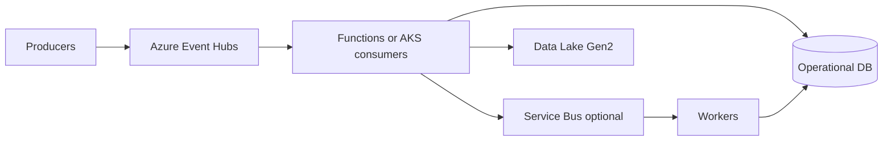

# Diagrams: event-driven architecture on Azure


```mermaid
flowchart LR
  P[Producers]
  EH[Azure Event Hubs]
  F[Functions or AKS consumers]
  SB[Service Bus optional]
  W[Workers]
  DB[(Operational DB)]
  L[Data Lake Gen2]
  P --> EH
  EH --> F
  F --> SB
  SB --> W
  F --> DB
  W --> DB
  F --> L
```

**ASCII**

```text
Producer -> Event Hubs -> Consumer -> (Service Bus) -> Worker -> DB
                        \-> Data Lake (analytics path)
```
