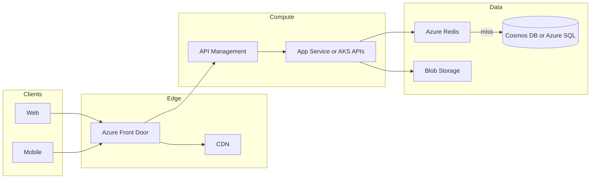
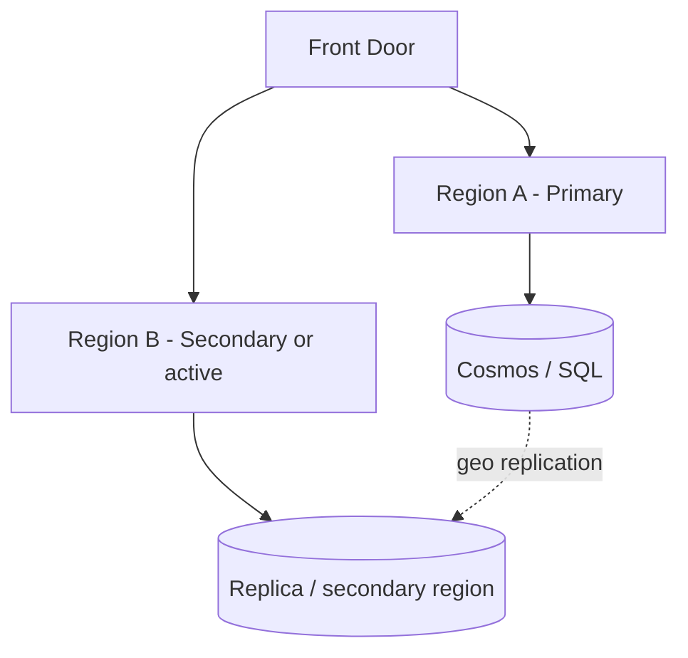

# Diagrams: global HA web app on Azure

## Request flow (read path)



## Multi-region (evolution)



ASCII fallback:

```text
Client -> Front Door -> APIM -> API -> Redis -> DB
                              \-> Blob
```
