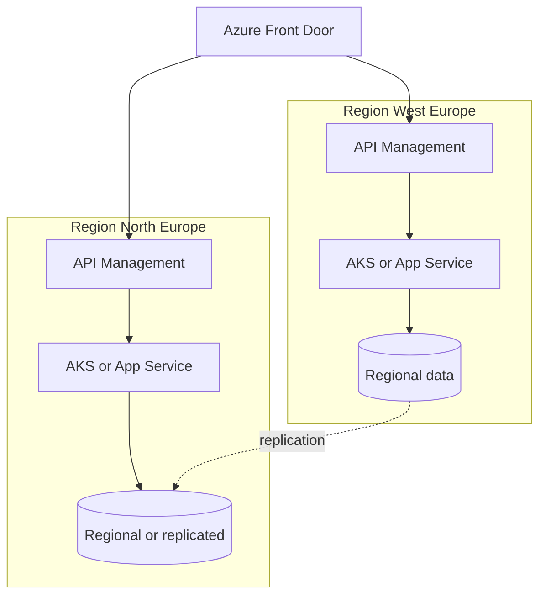

# Diagrams: multi-region API on Azure

```mermaid
flowchart TB
  FD[Azure Front Door]
  subgraph r1 [Region West Europe]
    APIM1[API Management]
    API1[AKS or App Service]
    DB1[(Regional data)]
  end
  subgraph r2 [Region North Europe]
    APIM2[API Management]
    API2[AKS or App Service]
    DB2[(Regional or replicated)]
  end
  FD --> APIM1
  FD --> APIM2
  APIM1 --> API1
  APIM2 --> API2
  API1 --> DB1
  API2 --> DB2
  DB1 -.replication.-> DB2
```
