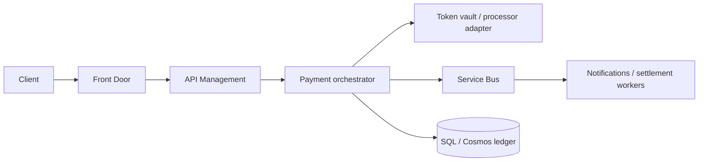

# Diagram: payments on Azure

```mermaid
flowchart LR
  C[Client]
  FD[Front Door]
  APIM[API Management]
  PO[Payment orchestrator]
  V[Token vault / processor adapter]
  SB[Service Bus]
  DB[(SQL / Cosmos ledger)]
  C --> FD --> APIM --> PO
  PO --> V
  PO --> DB
  PO --> SB
  SB --> N[Notifications / settlement workers]
```
