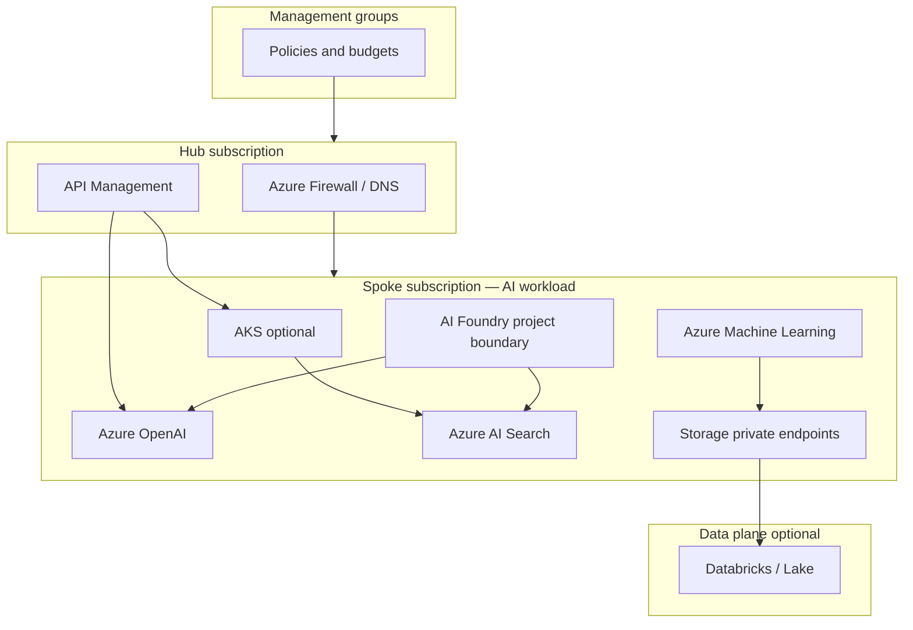
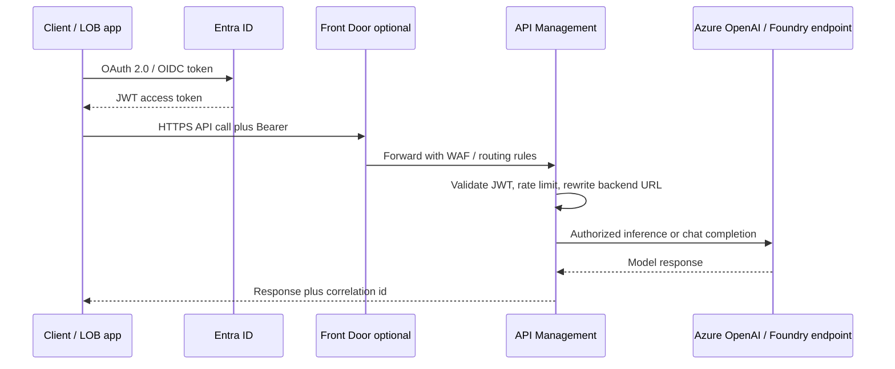
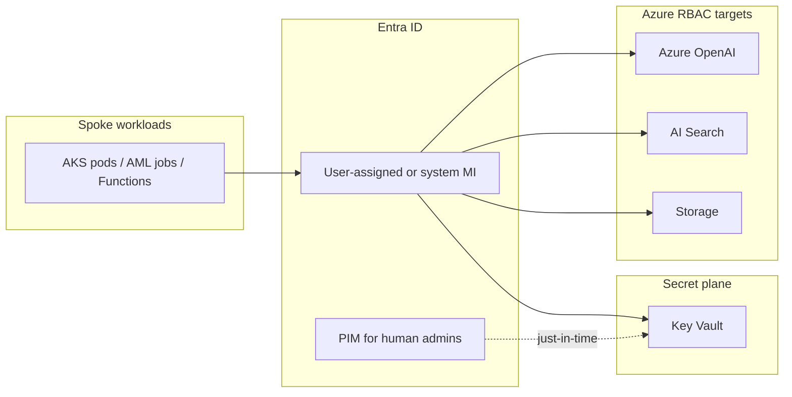
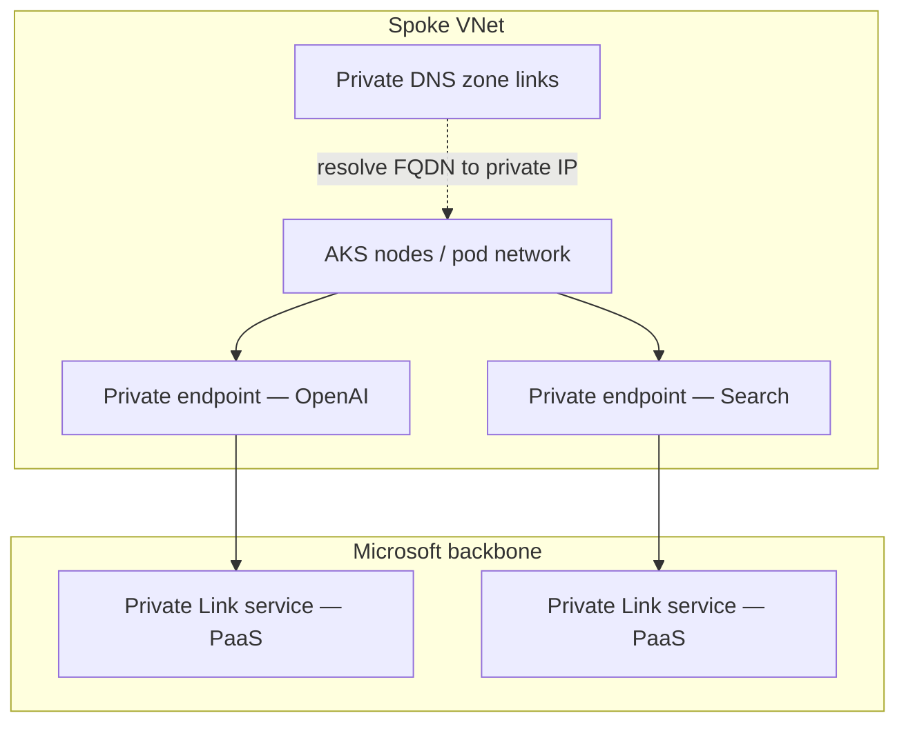
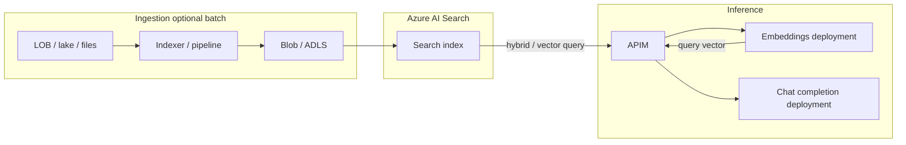
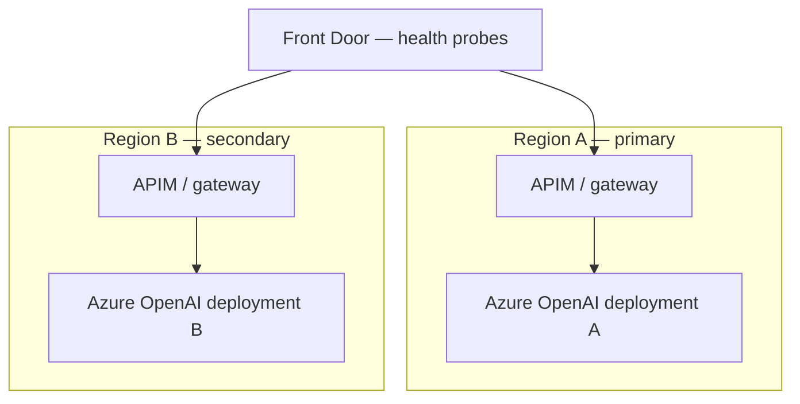
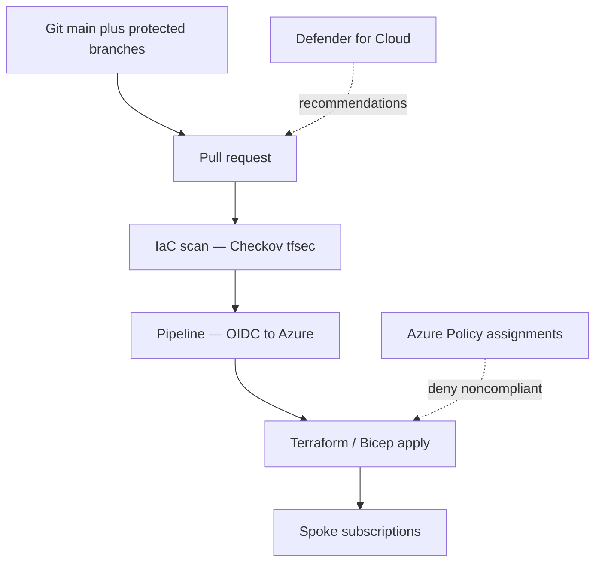

# Diagram: Azure AI platform landing zone

Use these on the whiteboard in order **1 → 2** for topology, then **pick 2–3** deep dives (3–6) by interview focus.

## 1. Hub–spoke and AI spoke (topology)

## 2. Edge request path (OAuth + façade)

**Narration:** Front Door is optional when you need global edge and WAF in front of APIM; small shops sometimes terminate at APIM with network rules.

## 3. Workload identity and secrets (no keys in repos)

## 4. Private Link path (why “works in portal, fails from AKS”)

**Narration:** Mis-linked **private DNS zones** or **split-horizon** mistakes are the usual production break; call out **DNS** explicitly in interviews.

## 5. RAG retrieval path (platform view)

**Narration:** Chargeback and throttling split across **Search SU**, **embedding** volume, and **completion** TPM; platform teams often own APIM policies and per-app keys.

## 6. Multi-region inference (active–active story)

**Narration:** Pair with **quota** and **data residency** caveats—second region only helps if **capacity** exists and **compliance** allows dual processing.

## 7. IaC and policy loop (drift and guardrails)

## Narration walkthrough

1. **Management groups** push **Azure Policy**, tags, and **Defender** baselines.
2. **Hub** provides **shared** egress, **DNS**, and optional **APIM** / **Front Door** entry.
3. **Spoke** hosts **AI** resources in a **project** or **RG** boundary with **Private Link** to PaaS where required.
4. **AML** and **storage** feed **training**; **optional Databricks** extends **lakehouse** and **Spark** analytics with governance story.
5. **GitOps / IaC** owns drift; **identity** is **workload-based** into **Key Vault** and **Azure RBAC**.
6. Use **diagram 2** when the interviewer asks how **OAuth** meets the **API**; **diagram 4** when debugging **connectivity**; **diagram 5** for **RAG** cost and ownership; **diagram 6** for **resilience**; **diagram 7** for **platform engineering** maturity.
