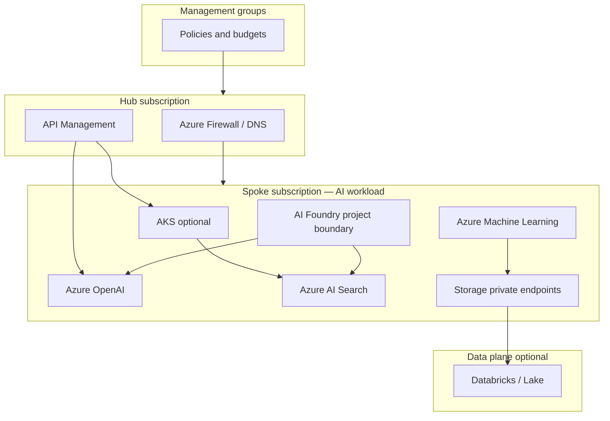

# Diagram: Azure AI platform landing zone

## Narration walkthrough

1. **Management groups** push **Azure Policy**, tags, and **Defender** baselines.
2. **Hub** provides **shared** egress, **DNS**, and optional **APIM** / **Front Door** entry.
3. **Spoke** hosts **AI** resources in a **project** or **RG** boundary with **Private Link** to PaaS where required.
4. **AML** and **storage** feed **training**; **optional Databricks** extends **lakehouse** and **Spark** analytics with governance story.
5. **GitOps / IaC** owns drift; **identity** is **workload-based** into **Key Vault** and **Azure RBAC**.
