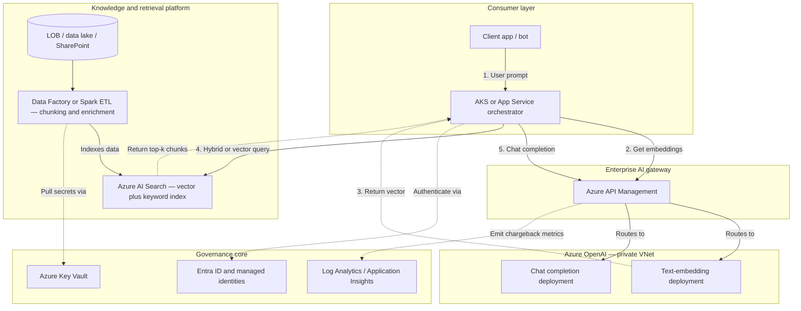

# Expanded enterprise RAG platform (principal bar)

**Intent:** Whiteboard-ready **flow** with **orchestrator** (AKS / App Service) owning retrieval logic, **APIM** as the **enterprise AI gateway** (not a bypass), plus **governance, security, and FinOps** called out explicitly.

**Contrast:** A prototype RAG app often calls OpenAI and a database **directly**. An **enterprise** RAG **platform** routes BUs through **policy**, **identity**, **private networking**, and **chargeback**—while keeping **retrieval quality** and **governance** as the durable IP.

---

## Architecture diagram

**Flow summary:** (1) User → orchestrator. (2–3) Orchestrator requests **embeddings** through **APIM** for query encoding. (4) Orchestrator queries **AI Search** (hybrid/vector). (5) Orchestrator sends **completion** through **APIM** with assembled context. Ingestion runs **outside** the hot path via **ADF** / Spark into **AI Search**.

---

## Speak-ready narration

### Hook

“A prototype RAG app connects directly to OpenAI and a database. An **enterprise** RAG **platform** connects business units **securely**, protects the **network boundary**, tracks **cost** at a granular level, and enforces **data isolation** in retrieval—not only at the API.”

### 1. Ingestion and data platform (foundation)

“We don’t dump files straight into an index. **ETL** (Azure Data Factory, Azure Databricks, or equivalent) pulls from **systems of record**. In the pipeline we apply **structural chunking**, **enrichment**, and **PII** handling per policy. Every chunk in **Azure AI Search** carries **document-level security** metadata (for example `AllowedGroups` for HR vs Legal) so that when the **orchestrator** queries the index, **Search** can **filter** chunks the caller is not allowed to see—**authorization is enforced at retrieval**, not only at the app shell.”

### 2. Enterprise AI gateway (governance and FinOps)

“No workload should call **Azure OpenAI** **directly** in production. **Everything** goes through **APIM** as the **AI gateway**. Operationally, that is where **FinOps** lands: policies can read claims from the **JWT** (for example **AppId** / BU), correlate with **token usage** from OpenAI **response headers**, and emit structured events to **Log Analytics** so finance sees **which BU** drove spend—supporting **chargeback** and **quotas** without ad-hoc spreadsheets.”

### 3. Identity and Zero Trust (security patterns)

“**No long-lived API keys** in app code for this path: the **orchestrator** uses **Entra workload identity** toward **APIM**; **APIM** uses **managed identity** (or controlled credentials) toward **Azure OpenAI**. **AI Search** and **storage** use **private endpoints** so traffic stays on the **Microsoft backbone** where required—**public attack surface** for the data plane is minimized by design.”

### 4. Throttling and scale (AKS and platform depth)

“Scaling RAG is not the same as scaling generic microservices.

- **AI Search (search units):** Scale-out is often **slow** (partition/replica changes can take many minutes). A **semantic cache** (for example **Azure Cache for Redis**) in front of the orchestrator absorbs **repeated** questions so they do not hammer the index on every turn.
- **OpenAI TPM:** A **batch** job from one BU can exhaust **tokens per minute** and **starve** interactive chat. In **APIM**, prefer **token-aware** throttling and **per-BU** (or per-product) limits so **noisy neighbors** are shaped **before** the service returns **429** to everyone.”

---

## Trade-offs and failure modes

### Hybrid vs vector-only retrieval

**Pure vector** search is cheap and fast but weak on **exact** matches (serial numbers, codes, named entities). **Hybrid** search plus **semantic ranker** in AI Search adds **latency** (~order of **100–200 ms** in many setups) and **SU** cost, but often **non-negotiable** for **enterprise recall**—the architect should say **why** they pay that premium.

### Stale context (index drift)

The dominant **operational** failure is the **index** lagging **source** systems. If ETL **fails silently**, the model still answers **confidently** on **old** policy. Mitigations: **SLA** on freshness, **alerts** on pipeline failure or staleness, and surfacing **`LastModified`** (or similar) in **context** or **citations** so users and support can spot **stale** answers.

---

## Principal differentiator (closing line)

“Foundational models will **commoditize**. The enterprise’s **durable** advantage is **retrieval quality** plus the **governance wrapper**—**APIM** policies, **identity**, **network**, **chargeback**, and **index security**. If the org swaps model **SKU** or adds an open-weight endpoint later, you **repoint** the **gateway** and **backend** routes; **apps**, **security posture**, and **FinOps** models stay **stable**.”

---

## Related in this track

- Landing-zone context: `../design-azure-ai-platform-landing-zone/diagram.md` (RAG platform view).
- Scenario bank: `../../01_templates/senior-ai-platform-architect-interviewer-guide.md` (S2 — production RAG).
- Service comparisons: `../../../01_azure-solutions-architect-role-pattern/01_templates/service-selection-guide.md`.
